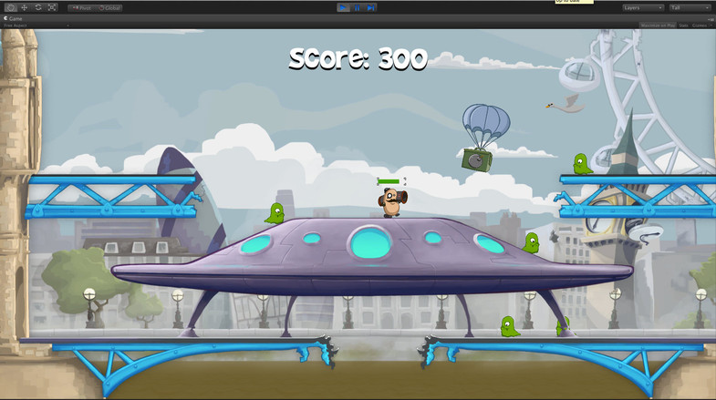

## 简介
The SLua version of Unity showcase demo : [2D Platformer](https://www.assetstore.unity3d.com/cn/#!/content/11228).

SLua 版本的 Unity 官方 2D 演示 Demo : 2D Platformer

2D Platformer 原始版本下载地址：https://www.assetstore.unity3d.com/cn/#!/content/11228

SLua 地址：http://www.slua.net/, https://github.com/pangweiwei/slua

## 特点
主要逻辑代码全部在 SLua 框架下的 Lua 代码中，除了基础通用功能以及需要导出给 Lua 使用的 C# 代码，大部分的游戏逻辑代码可以直接在 Lua 中编写而不需要任何 C# 代码，当有需要通过 Monobehavior 来驱动的 Lua 代码可以直接在游戏对象上挂接 YwLuaMonoBehaviour 并填入 Lua 类名，选取需要响应的事件函数并在 Lua 端实现接口内容即可。

不需要从 Monobehavior 来驱动的 Lua 代码可以全部以面向对象的方式写在 Lua 中（框架中提供了类定义接口 YwClass），由挂接在 YwDispatcher 上的各种继承自 YwRegisterObject 的对象来驱动和展开逻辑，具体可以根据自己的需求来扩充框架。

由于该框架目标是通过数据来驱动逻辑，所以数据的来源主要为数据表或者其它形式的本地数据源，而不是来自 Unity 编辑器中 Inspector 面板设置的各种数据，由于该框架目前尚未提供数据表模块，而为了方便从 Inspector 中提供给 YwLuaMonoBehaviour 对应的 Lua 中对象使用的数据，框架提供了 YwLuaMonoDataBridge 类与 YwLuaMonoBehaviour 同时挂接在游戏对象上来为其提供数据，提供了 int，float，string 三种数据类型，如果需要更多的类型，可以继承 YwLuaMonoDataBridge，例如框架中的：LgLuaMonoDataBridge。

为了效率，所有 Lua 代码的 Update 只有唯一的 C# 到 Lua 的入口，包括由 Monobehavior 所驱动的各种 Update，LateUpdate，FixedUpdate；同时框架提供了 LiteUpdate 用于 Lua 端的慢速逻辑帧，可在 YwGlobal 的对象上调整 LiteUpdate 的帧速率数值。

Lua 全局变量是非常容易因为笔误而引起不易察觉的内存泄漏问题的重要来源之一，所以该框架中全面禁止直接定义全局变量，必须使用 YwDeclare 来显示定义全局变量。

其他功能将持续更新，预计未来会加入：数据表读取，虚拟摇杆，对象池优化，Lua 内存检测工具，集成 ZeroBrane 调试，等等等等。。。

## 使用
请打开项目后直接打开 Assets/Game/Scenes/LevelStart.unity 来开始游戏，不要运行 Level.unity。

## 注意
本项目需要运行在 Unity 5.3 的版本中。

本项目所采用的 SLua 版本为自行编译的版本，具体为：SLua 1.1.1 + Lua 5.3.2 + lpeg 1.0.0 + sproto。

由于本项目代码基于 Lua 5.3，如果需要将所有代码放置在默认的 SLua 框架中，需要手动修改使用了位移操作符(<<, >>)的地方。

## 版权和授权协议
本项目中 SLua 基础代码及框架版权归 SLua 原作者所有。

本项目中所有除代码外的资源（包括但不限于音效，贴图，动画，模型等）版权归 [Unity](http://www.unity3d.com/) 所有。

本项目中 Lpeg 版权归原作者所有

本项目中 sproto 版权归原作者所有

本项目中除以上几项以外的代码（包括部分基础代码和所有移植的游戏代码）版权归该项目实际贡献者所有，且基于 MIT 协议的方式授权，具体内容请参见文件：LICENSE。
